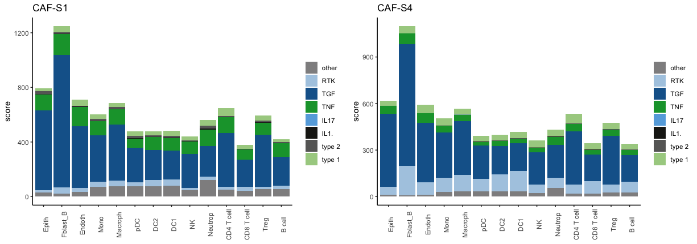

# Case study 1: dissect intercellular commmunication of Cancer Associated Fibroblasts subsets <a name="Case-study-1:-dissect-intercellular-commmunication-of-Cancer-Associated-Fibroblasts-subsets"></a>

**Cancer-associated fibroblasts** (CAFs) are stromal cells localized in the tumor microenvironment, known to enhance tumor phenotypes, such as cancer cell proliferation and inflammation. Previous studies have shown heterogeneity in CAFs phenotype ( [Kieffer et al.2020](https://cancerdiscovery.aacrjournals.org/content/early/2020/05/20/2159-8290.CD-19-1384) , [Costa et al. 2018](https://www.cell.com/cancer-cell/fulltext/S1535-6108(18)30011-4)). They identified 4 subsets of CAF, including CAF-S1 and CAF-S4 accumulating in Triple Negative Breast Cancer (TNBC). CAF-S1 has been notably associated with an immunosuppressive microenvironment. 

In this tutorial, we want to **study the difference of communication of CAF-S1 and CAF-S4 with the other components of the tumor microenvironment (TME), using available transcriptional profiles of CAF-S1 and CAF-S4 in TNBC** (data from [Costa et al. 2018](https://www.cell.com/cancer-cell/fulltext/S1535-6108(18)30011-4)). You can download the CAF dataset [here](https://github.com/soumelis-lab/ICELLNET/tree/master/data_CAF) to apply ICELLNET framework.

###Load database and restrict the database to the different family of cytokines
```{r,echo=T}
db=as.data.frame(read.csv(curl::curl(url="https://raw.githubusercontent.com/soumelis-lab/ICELLNET/master/database.tsv"), sep="\t",header = T, check.names=FALSE, stringsAsFactors = FALSE, na.strings = ""))
               
my.selection.LR=c("Cytokine")
db2 <- db[grepl(paste(my.selection.LR, collapse="|"),db$Classifications),] #if you want to use all the database, do instead : db2=db
db.name.couple=name.lr.couple(db2, type="Subfamily")
head(db.name.couple)
```

### Load partner cell types from Human Primary Cell Atlas dataset 

```{r,echo=T}
#download PC.data.all and PC.target.all objects
PC.data.all=as.data.frame(read.csv(curl::curl(url="https://raw.githubusercontent.com/soumelis-lab/ICELLNET/master/data/PC.data.all.csv"), sep=";",header = T, check.names=FALSE, stringsAsFactors = FALSE, na.strings = ""))
PC.target.all=as.data.frame(read.csv(curl::curl(url="https://raw.githubusercontent.com/soumelis-lab/ICELLNET/master/data/PC.target.all.csv"), sep=";",header = T, check.names=FALSE, stringsAsFactors = FALSE, na.strings = ""))

my.selection=c("Epith", "Fblast_B", "Endoth","Mono", "Macroph", "pDC", "DC2", "DC1", "NK", "Neutrop","CD4 T cell","CD8 T cell", "Treg","B cell")
PC.target = PC.target.all[which(PC.target.all$Class%in%my.selection | PC.target.all$Class%in%my.selection),c("ID","Class","Cell_type")]
PC.data = PC.data.all[,PC.target$ID]
```

To use Human Primary Cell Atlas dataset, we have to :

1. Create a conversion chart between the AffyID and the gene symbol that are used in the database, using the hgu133plus2.db() function.  

2.  Perform the gene.scaling() function, that will a) select genes corresponding to the ligands and/or receptors included in the database (db). b) scale each ligand/receptor gene expression among all the conditions ranging from 0 to 10. For each gene, the maximum value is defined as the mean expression of the 'n' highest values of expression. Gene expression are divided by the maximum gene expression and then multiplied by 10, scaling the data expression matrix between 0 and 10 for each gene, independantly.
Default value of n is 1. 
In this example, n is set to 18 in order to take the mean of the 5% extreme expression values as the maximum.

```{r, warning=F,echo=T}
### Convert the gene symbol to affy ID 
PC.affy.probes = as.data.frame(PC.data[,c(1,2)])
PC.affy.probes$ID = rownames(PC.affy.probes) # for format purpose
transform = db.hgu133plus2(db2,PC.affy.probes) # creation of a new db2 database with AffyID instead of gene symbol

##Gene scaling of the partner cell dataset
PC.data=gene.scaling(data = PC.data, n=18, db = transform) 
```

### Load central cell: CAF-S1 and CAF-S4 transcriptomic profiles 
This dataset provides the gene expression matrix of **77 samples** that corresponds to CAF subsets transcriptomic profiles that have been generated by [Costa et al. 2018](https://www.cell.com/cancer-cell/fulltext/S1535-6108(18)30011-4) to identify the four CAF subsets in breast cancers. **Each sample is described in the file CC.target**, that will allow us to select only the samples of our interest : the samples that correspond to either CAF-S1 or CAF-S4 from in Triple Negative Breast Cancer (TN) tumors. 


```{r,echo=T}
# Central cell data file (processed gene expression matrix)
data=as.data.frame(read.table(curl::curl(url="https://raw.githubusercontent.com/soumelis-lab/ICELLNET/master/data_CAF/data_CAF.txt"), sep="\t", header = T))
rownames(data)=data$SYMBOL
data=dplyr::select(data, -SYMBOL)
CC.data= gene.scaling(data = data, n=4, db = db2) 

#Target central cell file (description of the different samples)
CC.target = as.data.frame(read.table(curl::curl(url="https://raw.githubusercontent.com/soumelis-lab/ICELLNET/master/data_CAF/target_CAF.txt"),sep = "\t",header=T))
head(CC.target)
```
Same as for the PC.data, the gene expression matrix is rescaled ranging from 0 to 10 considering all the CAF samples to the largest distribution as possible.
At this stage, we select the samples of interest, which means CAF-S1 or CAF-S4 identified in the tumor (TNBC cancer type). This corresponds to 6 samples for CAF-S1 and 3 samples for CAF-S4.

```{r,echo=T}
CC.selection.S1 = CC.target[which(CC.target$Type=="T"&CC.target$subset=="S1"&CC.target$Cancer.subtype=="TN"),"Sample.Name"] # CAF-S1 in TNBC samples
CC.selection.S2 = CC.target[which(CC.target$Type=="T"&CC.target$subset=="S4"&CC.target$Cancer.subtype=="TN"),"Sample.Name"] # CAF-S4 in TNBC samples

CC.data.selection.S1 = CC.data[,which(colnames(CC.data)%in%CC.selection.S1)]
CC.data.selection.S2 = CC.data[,which(colnames(CC.data)%in%CC.selection.S2)]
```

### Computation of ICELLNET intercellular communication scores

```{r, warning=FALSE,echo=T}
score.computation.1= icellnet.score(direction="out", PC.data=PC.data, CC.data= CC.data.selection.S1,  
                                    PC.target = PC.target, PC=my.selection, CC.type = "RNAseq", 
                                    PC.type = "Microarray",  db = db2)
score1=as.data.frame(score.computation.1[[1]])
colnames(score1)="S1_TN"
lr1=score.computation.1[[2]]


score.computation.2= icellnet.score(direction="out", PC.data=PC.data, CC.data= CC.data.selection.S2,  
                                      PC.target = PC.target,PC=my.selection, CC.type = "RNAseq", 
                                      PC.type = "Microarray",  db = db2)
score2=as.data.frame(score.computation.2[[1]])
colnames(score2)="S4_TN"
lr2=score.computation.2[[2]]

Scores=cbind(score1,score2)
colnames(Scores)=c("S1_TN","S4_TN")
Scores
```

PC.target
score1 and score2 correspond to global scores, that are just the sum of the individual scores. Matrix of scores (Scores) corresponds to a summary of the global communication scores computed with ICELLNET between all peripheral cells and the central cell. lr1 and lr2 correspond to individual score matrix, and will be useful for the further visualisation steps.


### Dig into intercellular communication with the different visualisation modes  

####  Intercellular communication network representation

The scores matrix is first rescaled ranging from 0 to 10 to facilitate the visualisation of the network and the interpretation of the arrows.

```{r, echo=T, warning=FALSE, fig.height=7, fig.width=15}
#Score scaling
Scores.norm=(Scores-min(Scores))/(max(Scores)-min(Scores))*9+1
# Display intercellular communication networks
PC.col = c("Epith"="#C37B90", "Muscle_cell"="#c100b9","Fblast_B"="#88b04b", "Fblast"="#88b04b","Endoth"="#88b04b",
           "Mono"="#ff962c","Macroph"="#ff962c","moDC"="#ff962c","DC1"="#ff962c","DC2"="#ff962c","pDC"="#ff962c","NK"="#ff962c","Neutrop"="#ff962c",
           "CD4 T cell"="#5EA9C3","CD8 T cell"="#5EA9C3","Treg"="#5EA9C3","B cell"="#5EA9C3")

network.plot1 = network.create(icn.score = Scores.norm[1], scale = c(round(min(Scores.norm)),round(max(Scores.norm))), direction = "out", PC.col)
network.plot2 = network.create(icn.score =Scores.norm[2], scale = c(round(min(Scores.norm)),round(max(Scores.norm))), direction = "out",PC.col)
grid.arrange(network.plot1, network.plot2, ncol=2, nrow=1)
```


To assess the differences between scores in a quantitative manner, a statistical test can be performed (see "Compute pvalue to compare communication scores" section)

#### Communication molecules distribution - barplot representation 

```{r, echo=T, warning=F,  fig.height=5, fig.width=12 }
## Label and range definition

    ## label and color label if you are working families of molecules already present in the database
# my.family=c("Growth factor","Chemokine","Checkpoint","Cytokine","Notch signalling","Antigen binding") 
# family.col = c( "Growth factor"= "#AECBE3", "Chemokine"= "#66ABDF", "Checkpoint"= "#1D1D18"  ,
#             "Cytokine"="#156399", "Notch signalling" ="#676766", "Antigen binding" = "#12A039",  "other" = "#908F90",  "NA"="#908F90")
     
    ## label and color label if you are working with subfamilies of cytokines
my.family=c("type 1", "type 2", "IL1.", "IL17", "TNF","TGF","RTK")
family.col = c( "type 1"=  "#A8CF90", "type 2"= "#676766", "IL1."= "#1D1D18" ,
            "IL17" ="#66ABDF", "TNF" ="#12A039", "TGF" = "#156399", "RTK"="#AECBE3", "other" = "#908F90","NA"="#908F90")

ymax=round(max(Scores))+1 #to define the y axis range of the barplot

#Compute the contribution of each family of molecules to the global communication scores
contrib.family.1= LR.family.score(lr=lr1, my.family=my.family, db.couple=db.name.couple)
contrib.family.2= LR.family.score(lr=lr2, my.family=my.family, db.couple=db.name.couple)

#Display the contribution of each family of molecules in a barplot representation
barplot1=LR.family.barplot(contrib.family.1, title="S1_TN", ymax =ymax)
barplot2=LR.family.barplot(contrib.family.2, title="S4_TN", ymax = ymax)
grid.arrange(barplot1, barplot2, ncol=2, nrow=1)
```



#### Individual communication scores distribution - ballon plot representation

```{r, echo=T, warning=F}
lr_ind=cbind(lr1[,"Fblast_B"],lr2[,"Fblast_B"])
colnames(lr_ind)=c("S1_Fblast", "S4_Fblast")
balloon=icellnet::LR.balloon.plot(lr = lr_ind, PC = c("S1_Fblast", "S4_Fblast"), thresh = 20 , type="raw", db.name.couple=db.name.couple, title="Fblast")
balloon
```


#### Pvalue computation to compare communication scores


It returns the pvalue matrix of statistical tests, that can be visualize as a heatmap with the pvalue.plot() function. This allows to interpret the difference of communication score in a quantitative manner.


```{r, warning=F, message=F, echo=T}
# Comparison of the communication scores obtained from the CAF-S1 and the different partner cells
pvalue1=icellnet.score.pvalue(direction="out", PC.data=PC.data, CC.data= CC.data.selection.S1,
                              PC.target = PC.target,PC=my.selection, CC.type = "RNAseq",PC.type = "Microarray",
                              db = db2, family.type = "Subfamily", between="cells", method="BH")[[1]]
pvalue.plot1=pvalue.plot(pvalue1, PC=my.selection)
pvalue.plot1
```
```{r, warning=F, message=F, echo=T}
# Comparison of the communication scores obtained from the CAF-S4 and the different peripheral cells
pvalue2=icellnet.score.pvalue(direction="out", PC.data=PC.data, CC.data= CC.data.selection.S2,
                              PC.target = PC.target,PC=my.selection, CC.type = "RNAseq",PC.type = "Microarray",
                              db = db2, family.type = "Subfamily", between="cells", method="BH")[[1]]
pvalue.plot2=pvalue.plot(pvalue2, PC=my.selection)
pvalue.plot2
```
```{r, warning=F, message=F, echo=T}
# Comparison of the communication scores obtained from the CAF-S1 and from the CAF-S4 with the peripheral cells
pvalue.cond=icellnet.score.pvalue(direction="out", PC.data=PC.data, CC.data= CC.data.selection.S1, CC.data2= CC.data.selection.S2,
                                  PC.target = PC.target,PC=my.selection, CC.type = "RNAseq", PC.type = "Microarray",
                                  db = db2, family.type = "Subfamily", between="conditions", method="BH")[[1]]
pvalue.cond 
```
In this case, for all cell types, pvalue= 0.54. We do not have considered enough biological replicates, this is why the pvalue cannot be significant in this particular case study. 