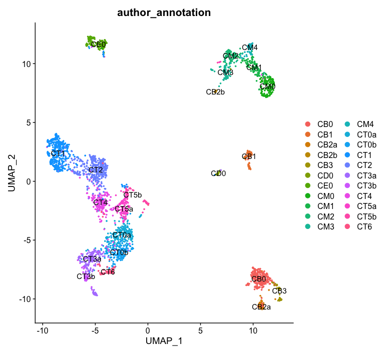
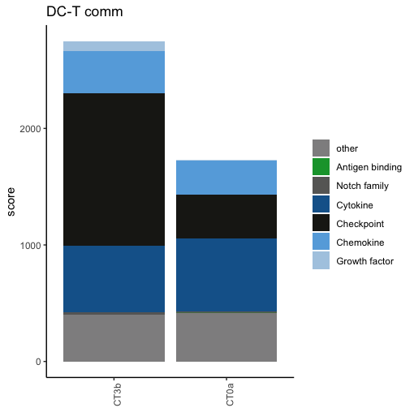
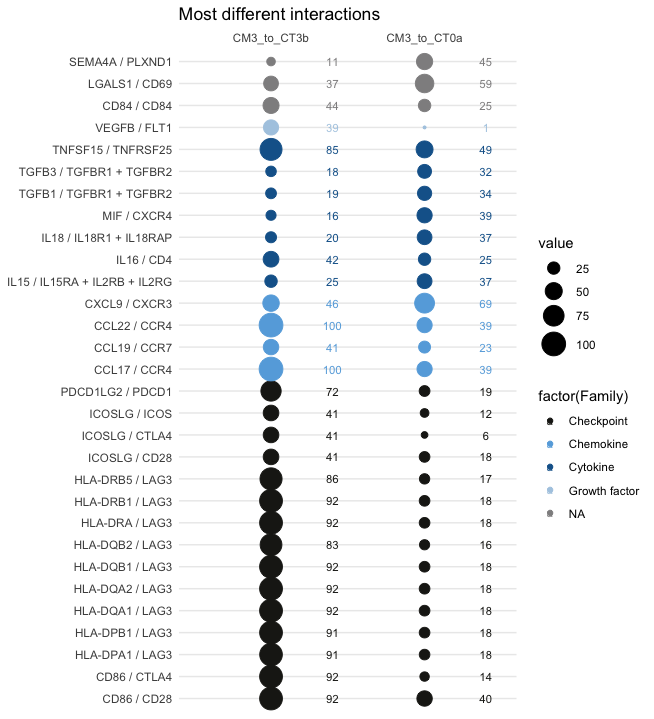

# Case study 2: dissect intercellular commmunication in single cell data from a Seurat object

Data from this tutorial are coming from [Arazi et al.2019] (https://pubmed.ncbi.nlm.nih.gov/31209404/) study. 

### Load libraries and ICELLNET database + compute db.name.couple
```{r,echo=T}

library(BiocGenerics)
library("org.Hs.eg.db")
library("hgu133plus2.db")
library(jetset)
library(ggplot2)
library(dplyr)
library(icellnet)
library(gridExtra)

library(Seurat)

db=as.data.frame(read.csv(curl::curl(url="https://raw.githubusercontent.com/soumelis-lab/ICELLNET/master/data/ICELLNETdb.tsv"), sep="\t",header = T, check.names=FALSE, stringsAsFactors = FALSE, na.strings = ""))
               
db.name.couple=name.lr.couple(db, type="Family")
head(db.name.couple)
```
### 1 - Load Seurat object

```{r, warning=F, echo=T}

#Load data
seurat <- readRDS(file = "Lupus_Seurat_SingleCell_Landscape.Rds")
seurat <- NormalizeData(seurat)
seurat <- ScaleData(seurat)

#only for UMAP visualisation, not for ICELLNET purpose
seurat <- FindVariableFeatures(seurat, selection.method = "vst", nfeatures = 2000)
seurat <- RunPCA(seurat)
seurat <- RunUMAP(seurat, dims = 1:50)
DimPlot(seurat, reduction = 'umap', group.by = 'author_annotation', label = T)
```


### 2 - Retrieve count matrix and compute manually average gene expression per cluster

```{r, warning=F, echo=T}
data <- as.data.frame(GetAssayData(seurat, slot = "counts"))
target <- seurat@meta.data
target$Class=target$author_annotation
target$Cell=rownames(target)
head(target)


average.manual=matrix(ncol=length(unique(target$author_annotation)), nrow=length(rownames(data)))
colnames(average.manual)=unique(target$author_annotation)
rownames(average.manual)=rownames(data)
dim(average.manual)
for (cell in unique(target$author_annotation)){
  cells.clust=target$Cell[which(target$author_annotation==cell)]
  average.manual[,cell]=apply(data[,which(colnames(data)%in%cells.clust)], 1, mean)
}
```


### 3 - Apply icellnet pipeline on cluster of interest

In this example, we investigate cDC to T cell communication from CM3 cluster (= conventional dendritic cells, 82 cells), to either CT3b or CT0a clusters (CT3b=TFH-like cells, 50 cells ; CT0a = effector memory CD4+ T cells, 220 cells). 

Format CC.data and PC.data and PC.target
```{r, warning=F, echo=T}

data.icell=as.data.frame(gene.scaling(as.data.frame(average.manual), n=1, db=db))


PC.data=as.data.frame(data.icell[,c("CT3b","CT0a", "Symbol")], row.names = rownames(data.icell))


PC.target=data.frame("Class"=c("CT3b","CT0a"), "ID"= c("CT3b","CT0a"), "Cell_type"=c("CT3b","CT0a"))
rownames(PC.target)=c("CT3b","CT0a")

my.selection=c("CT3b","CT0a")
```

Compute intercellular communication scores
```{r, warning=F, echo=T}
score.computation.1= icellnet.score(direction="out", PC.data=PC.data, 
                                    CC.data= as.data.frame(data.icell[,c("CM3")], row.names = rownames(data.icell)),  
                                    PC.target = PC.target, PC=my.selection, CC.type = "RNAseq", 
                                    PC.type = "RNAseq",  db = db)
score1=as.data.frame(score.computation.1[[1]])
lr1=score.computation.1[[2]]

```
Visualisation of contribution of family of molecules to communication scores

```{r, warning=F, echo=T}
# label and color label if you are working families of molecules already present in the database
my.family=c("Growth factor","Chemokine","Checkpoint","Cytokine","Notch signalling","Antigen binding")
family.col = c( "Growth factor"= "#AECBE3", "Chemokine"= "#66ABDF", "Checkpoint"= "#1D1D18"  ,
            "Cytokine"="#156399", "Notch signalling" ="#676766", "Antigen binding" = "#12A039",  "other" = "#908F90",  "NA"="#908F90")
            
ymax=round(max(score1))+1 #to define the y axis range of the barplot

LR.family.score(lr=lr1, my.family=my.family, db.couple=db.name.couple, plot=F) # table of contribution of each family of molecule to the scores

LR.family.score(lr=lr1, my.family=my.family, db.couple=db.name.couple, plot=T, title="DC-T comm", family.col=family.col) #display barplot
```


Visualisation of highest and most different interactions between the two conditions (here, selection of interaction with difference of >10 units, and visualiation of topn=40 interactions).

```{r, warning=F, echo=T}
delta.com=as.data.frame(lr1[which((abs(lr1[,1]-lr1[,2])>10)==TRUE),])
colnames(delta.com)=c("CM3_to_CT3b", "CM3_to_CT0a")
LR.balloon.plot(lr = delta.com, thresh = 0 , topn=40 , db.name.couple=db.name.couple, family.col=family.col, title="Most different interactions")
```
