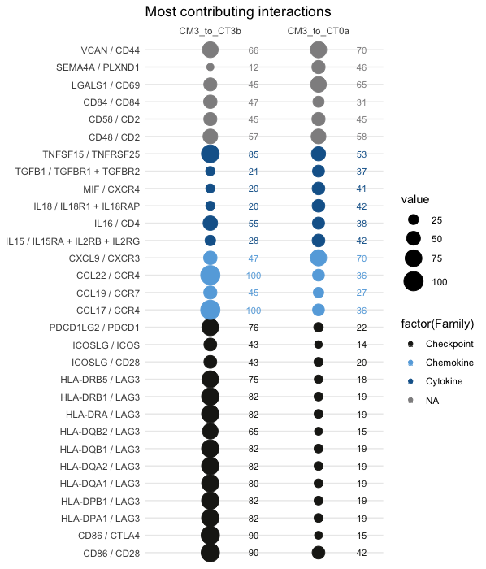
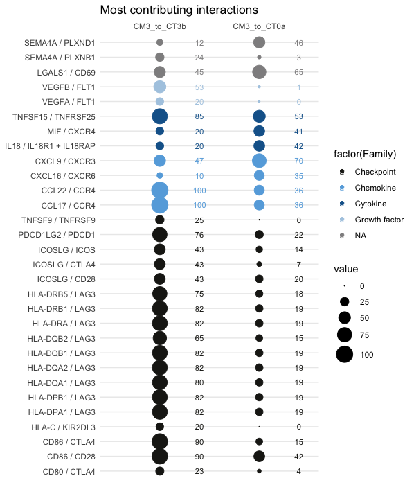

# Case study 2: dissect intercellular commmunication in single cell data from a Seurat object

Data used in this tutorial are coming from [Arazi et al.2019](https://pubmed.ncbi.nlm.nih.gov/31209404/) study. [Here](https://github.com/soumelis-lab/ICELLNET/blob/master/Code_SeuratObject_Exemple2.md) is the code we used to create the SeuratObject used in the tutorial.

### Load libraries and ICELLNET database + compute db.name.couple
```{r,echo=T}

library(BiocGenerics)
library("org.Hs.eg.db")
library("hgu133plus2.db")
library(jetset)
library(ggplot2)
library(dplyr)
library(icellnet)
library(gridExtra)

library(Seurat)

db=as.data.frame(read.csv(curl::curl(url="https://raw.githubusercontent.com/soumelis-lab/ICELLNET/master/data/ICELLNETdb.tsv"), sep="\t",header = T, check.names=FALSE, stringsAsFactors = FALSE, na.strings = ""))
               
db.name.couple=name.lr.couple(db, type="Family")
head(db.name.couple)
```
### 1 - Load Seurat object

```{r, warning=F, echo=T}

#Load data
seurat <- readRDS(file = "Lupus_Seurat_SingleCell_Landscape.Rds")
seurat <- NormalizeData(seurat)
seurat <- ScaleData(seurat)

#only for UMAP visualization, not for ICELLNET purpose
seurat <- FindVariableFeatures(seurat, selection.method = "vst", nfeatures = 2000)
seurat <- RunPCA(seurat)
seurat <- RunUMAP(seurat, dims = 1:50)
DimPlot(seurat, reduction = 'umap', group.by = 'author_annotation', label = T)
```


### 2 - Retrieve gene expression matrix 
 
#### a - Compute manually average gene expression per cluster without filtering 

```{r, warning=F, echo=T}
# Taking into account the total nb of cells in each cluster
filter.perc=0
average.clean= sc.data.cleaning(object = seurat, db = db, filter.perc = filter.perc, save_file = T, path="path/", force.file = F)
```

#### b - Compute manually average gene expression per cluster with filtering for gene expression by a defined cell percentage at a cluster level

ICELLNET offers the possibility to filter the initial gene expression matrix to keep genes at least expressed by defined percentage of cell in their respective cluster (below 2%): 

```{r, warning=F, echo=T}
filter.perc=2
average.clean= sc.data.cleaning(object = seurat, db = db2, filter.perc = filter.perc, save_file = T, path="path/", force.file = F)
```
This filtering allows to remove all the genes that are expressed by a very low number of cells in some clusters, to avoid false negative cell-cell interactions scores. If you are applying ICELLNET for the first time on your dataset, we advice to apply first ICELLNET without filtering, and then with filtering at 2% to see the differences and filtered genes. This will help a lot in the analysis and for biological interpretation of the data(see steps 3 and 4).

#### c - Compute manually average gene expression per cluster without starting from a SeuratObject.

If your are starting from a SeuratObject, continue directly on step 3.

If you are not starting from a SeuratObject but from a matrix of count, check that the matrix is normalised by library size and follow the steps below (explained with Seurat packages references for formatting).

```{r, warning=F, echo=T}
data <- as.data.frame(GetAssayData(seurat, slot = "data")) #or other matrix for which features expression values # are scaled by the total expression in each cell

target <- seurat@meta.data
target$Class=target$author_annotation
target$Cell=rownames(target)

average.manual=matrix(ncol=length(unique(target$author_annotation)), nrow=length(rownames(data)))
colnames(average.manual)=unique(target$author_annotation)
rownames(average.manual)=rownames(data)
dim(average.manual)
for (cell in unique(target$author_annotation)){
  cells.clust=target$Cell[which(target$author_annotation==cell)]
  average.manual[,cell]=apply(data[,which(colnames(data)%in%cells.clust)], 1, mean)
}

average.clean=average.manual
```

### 3 - Apply icellnet pipeline on cluster of interest

In this example, we investigate cDC to T cell communication from CM3 cluster (= conventional dendritic cells, 82 cells), to either CT3b or CT0a clusters (CT3b=TFH-like cells, 50 cells ; CT0a = effector memory CD4+ T cells, 220 cells). 


Format CC.data and PC.data and PC.target
```{r, warning=F, echo=T}

data.icell=as.data.frame(gene.scaling(as.data.frame(average.clean), n=1, db=db))

PC.data=as.data.frame(data.icell[,c("CT3b","CT0a", "Symbol")], row.names = rownames(data.icell))


PC.target=data.frame("Class"=c("CT3b","CT0a"), "ID"= c("CT3b","CT0a"), "Cell_type"=c("CT3b","CT0a"))
rownames(PC.target)=c("CT3b","CT0a")

my.selection=c("CT3b","CT0a")
```

**Compute intercellular communication scores**

We investigate conventional dendritic cells (cDCs, CM3 cluster) to T cell (either CT3b or CT0a clusters) outward communication, so this means that we consider ligands expressed by cDCs and receptors expressed by T cells to compute intercellular communication scores. 
Outward communication -> direction = "out"

```{r, warning=F, echo=T}
score.computation.1= icellnet.score(direction="out", PC.data=PC.data, 
                                    CC.data= as.data.frame(data.icell[,c("CM3")], row.names = rownames(data.icell)),  
                                    PC.target = PC.target, PC=my.selection, CC.type = "RNAseq", 
                                    PC.type = "RNAseq",  db = db)
score1=as.data.frame(score.computation.1[[1]])
lr1=score.computation.1[[2]]

```
**Visualisation of contribution of family of molecules to communication scores**

```{r, warning=F, echo=T}
# label and color label if you are working families of molecules already present in the database
my.family=c("Growth factor","Chemokine","Checkpoint","Cytokine","Notch family","Antigen binding")
family.col = c( "Growth factor"= "#AECBE3", "Chemokine"= "#66ABDF", "Checkpoint"= "#1D1D18"  ,
            "Cytokine"="#156399", "Notch family" ="#676766", "Antigen binding" = "#12A039",  "other" = "#908F90",  "NA"="#908F90")
            
ymax=round(max(score1))+1 #to define the y axis range of the barplot

LR.family.score(lr=lr1, my.family=my.family, db.couple=db.name.couple, plot=F) # table of contribution of each family of molecule to the scores

LR.family.score(lr=lr1, my.family=my.family, db.couple=db.name.couple, plot=T, title="DC-T comm", family.col=family.col) #display barplot
```


**Visualisation of highest and most different interactions between the two conditions (selection of topn=30 interactions):** 

**30 first most contributing interactions (sort.by="sum")**
```{r, warning=F, echo=T}
colnames(lr1)=c("CM3_to_CT3b", "CM3_to_CT0a")
LR.balloon.plot(lr = lr1, thresh = 0 , topn=30 , sort.by="sum",  db.name.couple=db.name.couple, family.col=family.col, title="Most contributing interactions")
```



**30 first most different interactions between the conditions (sort.by="var")**
```{r, warning=F, echo=T}
colnames(lr1)=c("CM3_to_CT3b", "CM3_to_CT0a")
LR.balloon.plot(lr = lr1, thresh = 0 , topn=30 , sort.by="var",  db.name.couple=db.name.couple, family.col=family.col, title="Most contributing interactions")
```


### Remarks on biological interpretation: 

- **ICELLNET will always set, for each gene, maximum gene expression value at 10**. Then, the maximum score that you can obtain for an individual interaction is 100 (10 for the ligand, 10 for the receptor). 

- This means that high interaction scores does not mean high expression. You **should come back to the initial SeuratObject to look at individual gene expression**, and that the ligand/receptor of interest if effectively expressed by the cluster.

- **Filtering of genes expressed by each cluster according to cell percentage expressing the gene (= with counts >0) for each cluster can be an option to remove false-negative interactions scores.**  This can be done with the sc.data.clean function, by setting filter.perc to a defined value (2 for 2%, 5 for 5% etc...). Filtered genes (expressed by a number of cells among the cluster below the percentage) will be set to 0. 


