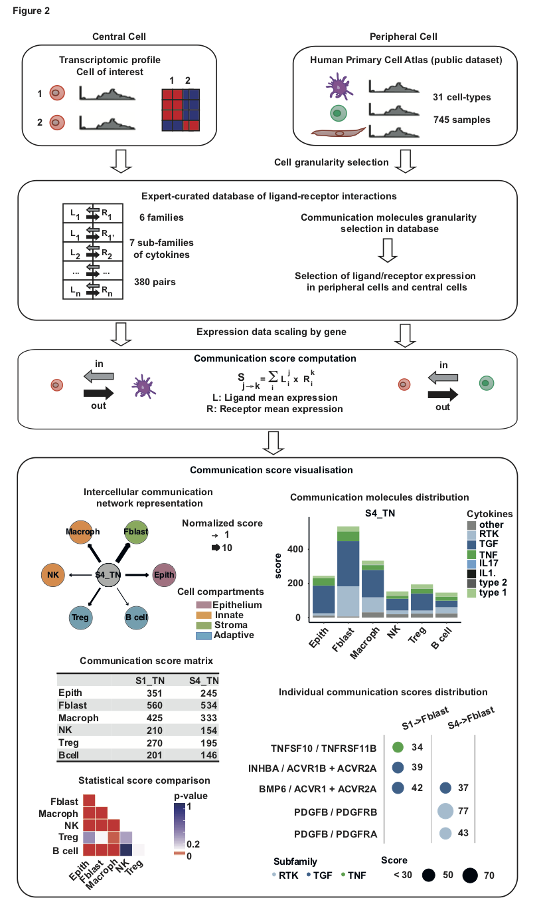

This vignette explains the use of the ICELLNET package and demonstrates typical workflows to dissect intercellular communication between multiples cell types, based on transcriptomic profiles.

---
# Table of content

- [Introduction to ICELLNET package](#Introduction-to-ICELLNET-package)
  * [What is ICELLNET for? ](##What-is-ICELLNET-for?)
  * [ICELLNET ligand/receptor interaction database](##ICELLNET-ligand/receptor-interaction-database) 
  * [Input data](##Input-data)
  * [How is the intercellular communication score computed?](##How-is-the-intercellular-communication-score-computed?)
  * [Typical workflow](##Typical-workflow)
  * [Visualisation modes](##Visualisation-modes)
- [How to install ICELLNET package?](#How-to-install-ICELLNET-package?)
- [How to format your own data to use ICELLNET package?](#How-to-format-your-own-data-to-use-ICELLNET-package?)
- [Case study 1: IL-10 controls an intercellular communication module in LPS-activated dendritic cells](#Case-study-1:-IL-10-controls-an-intercellular-communication-module-in-LPS-activated-dendritic-cells)
- [Case study 2: dissect intercellular commmunication of Cancer Associated Fibroblasts subsets](#Case-study-2:-dissect- intercellular-commmunication-of-Cancer-Associated-Fibroblasts-subsets)

<!-- toc -->
---


# Introduction to ICELLNET package

## What is ICELLNET for? 

Cell-to-cell communication is at the basis of the higher-order organization observed in tissues, organs, and organisms, at steady state and in response to stress. The availability of large-scale transcriptomics datasets from several cell types has opened the possibility of **reconstructing cell-cell interactions based on co-expression of ligand-receptor pairs**. Important challenges remain, including the global integration of cell-cell communication, biological interpretation, the inference of communication between cell types not necessarily represented in the same dataset. We developed **ICELLNET**, a transcriptomic-based framework to **dissect cell communication in a global manner**. It integrates an original expert-curated **database of ligand-receptor interactions** taking into account multiple subunits expression. Based on transcriptomic profiles (gene expression), ICELLNET package allows to compute **communication scores** between cells and provides **several visualization modes** that can be helpful to dig into cell-cell interaction mechanism and extend biological knowledge. 

## ICELLNET ligand/receptor interaction database 

We have curated a comprehensive database of ligand-receptor interactions from the literature and public databases. This database takes into account the **multiple subunits** of the ligands and the receptors. Also, all these interactions have been classified into 6 families of communication molecules, with strong implication in inflammatory and immune processes: Growth factors, Cytokines, Chemokines, Checkpoints, Notch signaling, Antigen binding. The cytokines have been further classified into 7 subfamilies according to reference classifications essentially based on structural protein motifs: type 1 cytokines, type 2 cytokines, IL-1 family, IL-17 family, TNF family, TGFb family and RTK cytokines. 

You can visualise the ICELLNET database and its structure by doing: 

```{r db, echo=T}
head(db)
```

You can use either all the database or restrict the database by selecting some specific class of molecules (Cytokines, Growth factor etc..). Below, we show you how to restrict the study to cytokines, chemokines, and checkpoints. If you restrict the database to cytokines, you can take into consideration the subfamily of cytokines.

```{r, echo=T}
summary(as.factor(db$Family)) # list of the different family of molecules considered in the database
summary(as.factor(db$Subfamily[which(db$Family=="Cytokine")])) # list of the different subfamily of cytokines considered in the database

#Restrict the database to some family of molecules 
my.selection.LR=c("Cytokine", "Chemokine", "Checkpoint")
db2 <- db[grepl(paste(my.selection.LR, collapse="|"),db$Classifications),] 
db.name.couple=name.lr.couple(db2, type="Family")
head(db.name.couple)

#Restrict the database to cytokines and consider the subfamilies of cytokines
my.selection.LR=c("Cytokine")
db3 <- db[grepl(paste(my.selection.LR, collapse="|"),db$Classifications),] #if you want to use all the database, do instead : db2=db
db.name.couple=name.lr.couple(db3, type="Subfamily")
head(db.name.couple)
```
Instead of using the ICELLNET database, it is also possible to use its own database as long as it is correctly formatted with specific columns as below. The Family and Subfamily colums correspond to two independant classifications (per family of molecules, or other) of your choice, but each interaction should fit only in one category of the classification (for example, an interaction cannot be classified in "type 1" and also "type 2" cytokines in the ICELLNET database). In the Classifications category, you should add all the terms used to classify the interaction : the one of Family, Subfamily, but also other words that can be used to select some specific interactions (for example "interleukin" in ICELLNET database).

|  Ligand 1 | Ligand 2  | Receptor 1  | Receptor 2  | Receptor 3  | Family | Subfamily | Classifications |
|---|---|---|---|---|---|---|---|
|   |   |   |   |   |   |   |   |
|   |   |   |   |   |   |   |   |

## Input data 
### Type of data
ICELLNET pipeline first considers the transcriptomic profile of the central cell, that can correspond to several biological conditions. ICELLNET will then allow to compare the communication channels used by the central cells in these different conditions with peripheral cells.
As peripheral cells, we use BioGPS, a public datasets of 746 transcriptomic profiles among 32 cell types generated with the same technology (Affymetrix microarray, hgu133plus2 platform), already processed. It is possible to select up to 14 different cell types to connect with the central cell (the different options are listed below, in PC.target.all$Class).This number was chosen for clarity purpose. The user can also use other transcriptomic profiles instead of BioGPS.

```{r,echo=T}
head(PC.data.all[1:5,1:5])
```
```{r,echo=T}
summary(as.factor(PC.target.all$Class))
```

### Files format
**For the central cell:** It can be any transcriptomic profile data of one cell type. For **RNA-seq data**, the dataset should be annotated with gene symbol as rownames, and also in a specific column named SYMBOL. For **microarray data**, the ICELLNET functions are adapted to handle Affymetrix Human Genome U133 Plus 2.0 Array annotation. Nevertherless, if the dataset have been generated with an other Affymetrix technology, you have 2 possibilities to adapt the tool : a) Annotate your data with gene symbol before using ICELLNET and then consider your data as "RNA-Seq" for CC.type argument. b) adapt the R code of the `db.hgu133plus2()` function to have the right annotation conversion when using ICELLNET. Same as for RNAseq, the annotations should be set as rownames and in a ID column. 


**For the peripheral cell (if you don't want to use BioGPS as peripheral cells):** This can be interesting for example if you possess transcriptomic data of several cell types of the same sample, to see how they interact together. As for the central cell, the transcriptomic profiles should be correctly formated (see previous paragraph above for more information). If your transcriptomic profiles are annotated with gene symbol, PC.type should be set to "RNA-seq" (even if your data come from microarray technology). 


## How is the intercellular communication score computed?

The quantification of intercellular communication consist of scoring the intensity of each ligand/receptor interaction between two cell types with known expression profiles. No filtering threshold is applied on the L/R expression. If the communication molecule (ligand or receptor or both) is not expressed by a cell, the score will be zero. By default, the 380 interactions of the database are considered to compute the score. It is also possible to reduce the number of interactions by manually selecting specific families of molecules in the database or considering DEG to compute the score, depending on the biological question. Whenever needed, we take into account multiple ligand units, or receptor chains, using logical rules.

The score of an individual ligand/receptor interaction is computed as the product of their expression levels respectively by the source (central) and by the target (peripheral) cell. These individual scores are then combined into a global metric assessing the overall exchange of information between the cell types of interest

Since cell-to-cell communication is directional, we consider ligand expression from the central cell and receptor expression from the peripheral cells to assess outward communication. On the other way, we select receptor expression from the central cell and ligand expression from peripheral cells to assess in-flow communication. This is controlled by the  *direction* argument ("in" or "out") in the `icellnet.score()` function. 

## Typical workflow 
 
Here we describe the different stages of the ICELLNET package to compute intercellular communication scores: 

1. Selection of the genes coding for the ligands and the receptors in our database from the transcriptomic profiles of the central cell and the peripheral cells. 

2. Rescale gene expression to avoid communication score to be driven only by highly expressed genes.

3. Compute ICELLNET communication scores

4. Display different visualisation modes to dissect intercellular communication scores 



## Visualisation modes

### Intercellular communication network representation

This allows to visualize intercellular communication networks in a global manner through the function `network.create()`. In these directed graphs, nodes represent cell types, the width of the edges connecting two cell types is proportional to a global measure of the intensity of the communication between them and the arrows indicate the direction of communication. 

### Communication molecules distribution

The barplot representation (`LR.family.score()` an then  `LR.family.barplot()` functions) allows to dissect the global scores at a level of class of molecules, and allows to identify patterns of co-expressed molecules from the same family. This layer of analysis helps the interpretation on a qualitative level.

### Individual communication scores distribution

The balloon plot (`LR.balloon.plot()` function) is the deepest level of representation of the communication, displaying the most contributing ligand/receptor pairs to the communication score. This allows to identify specific individual interactions that can drive the intercellular communication and should be confirmed experimentally. 

### Pvalue computation to compare communication scores

Two types of pvalue can be computed (`icellnet.score.pvalue()` function), to compare either the communication scores obtained from the same central cell to different peripheral cells (between="cells"), or to compare the communication scores obtained from two different central cells corresponding to different biological conditions with the same peripheral cell (between="conditions").If between="cells", the communication score is computed considering the average expression of ligands for the central cell, and each replicates separately for the receptor expression of the peripheral cells. In this way, for one peripheral cell type, we obtain a distribution of n communication scores, n beeing the number of peripheral cells replicates for this particular cell type. If between="conditions", then, the communication score is computed considering each replicates of the central cell separately, and the average gene expression for the peripheral cells. We obtain a distribution of n communication scores, n beeing the number of central cell replicates in one biological condition. Then, a Wilcoxon statistical test is performed to compare the communication scores distributions. The pvalues are ajusted with `p.adjust()`, with "BH" method as a default. 

It returns the pvalue matrix of statistical tests, that can be visualize as a heatmap with the `pvalue.plot()` function. This allows to interpret the difference of communication score in a quantitative manner.
 
# How to install ICELLNET package?


To install `icellnet` package, the easiest way is to use the `R` package `devtools` and its function `install_github`:

    install.packages(c("devtools", "jetset", "readxl", "psych", "GGally", "gplots", "ggplot2", "RColorBrewer", "data.table", "grid", "gridExtra", "ggthemes", "scales","rlist") ##Installs devtools and the icellnet dependancies

    if (!requireNamespace("BiocManager", quietly = TRUE))
    install.packages("BiocManager")

    BiocManager::install("BiocGenerics", "org.Hs.eg.db", "hgu133plus2.db", "annotate")
    
    library(devtools)
    install_github("soumelis-lab/ICELLNET",ref="master", subdir="icellnet")
Once all the dependencies are downloaded and loaded, you can load the `icellnet` package.

```{r, echo=T, message=FALSE}
library(icellnet)
```

# How to format your own data to use ICELLNET package? 

## Data files format
**For the central cell:** It can be any transcriptomic profile data of one cell type. For **RNA-seq data**, the dataset should be annotated with gene symbol as rownames, and also in a specific column named 'Symbol'. For **microarray data**, the ICELLNET functions are adapted to handle Affymetrix Human Genome U133 Plus 2.0 Array annotation. Nevertherless, if the dataset have been generated with an other Affymetrix technology, you have 2 possibilities to adapt the tool : a) Annotate your data with gene symbol before using ICELLNET and then consider your data as "RNA-Seq" for CC.type argument. b) adapt the R code of the db.hgu133plus2() function to have the right annotation conversion when using ICELLNET. Same as for RNAseq, the annotations should be set as rownames and in a ID column. 

**For the peripheral cell (if you don't want to use BioGPS as peripheral cells):** This can be interesting for example if you possess transcriptomic data of several cell types of the same sample, to see how they interact together. As for the central cell, the transcriptomic profiles should be correctly formattted (see previous paragraph above for more information). If your transcriptomic profiles are annotated with gene symbol, PC.type should be set to "RNA-seq" (even if your data come from microarray technology). 

## Target files format
You should define two dataframes as target files, one corresponding to the central cell, and the other one corresponding to the peripheral cells. These dataframe usually describes the different samples. 

**PC.target** should contains at least an 'ID' column including the name of the samples (usually rownames(PC.data)), and a 'Class' column corresponding to a classification of your different samples included in PC.data, such as a cell type classification. The different categories included in the 'Class' column will define the different peripheral cells in the graphs.


# Case study 1: IL-10 controls an intercellular communication module in LPS activated dendritic cells 

In this example, we are interested in **studying communication of resting and perturbed immune cells**. To explore the role of autocrine loops, we cultured LPS-activated human monocyte-derived dendritic cells (DCs) in the presence or absence of blocking antibodies (Abs) to the TNF and IL-10 receptors (αTNFR and αIL10R). We want to compare the communication channels that are used by the DCs in the different activation modes.

**Quick experimental information:** Primary cells were extracted from human blood, and the DCs were isolated by negative selection. They were then activated for 8 hours by being cultured either in presence of LPS, LPS+aTNFR, LPS+aIL10. The control condition corresponds to dendritic cells cultured with medium only. Transcriptomic profiles of dendritic cells in each condition were generated using **Affymetrix technology** (hgu133plus2 platform).

### Load database

```{r,echo=T}
db.name.couple=name.lr.couple(db, type="Family")
head(db.name.couple)
```

### Load peripheral cell types: BioGPS dataset 

```{r,echo=T}
my.selection = c("Epith", "Fblast","Endoth","Mono","Macroph","NK","Neutrop","B cell")
PC.target = PC.target.all[which(PC.target.all$Class%in%my.selection),c("ID","Class","Cell_type")]
PC.data = PC.data.all[,PC.target$ID]
```

To use BioGPS dataset, we have to : \n 

1. Create a conversion chart between the AffyID and the gene symbol that are used in the database, using the hgu133plus2.db() function. \n  

2.  Perform the gene.scaling() function, that will a) select genes corresponding to the ligands and/or receptors included in the database (db). b) scale each ligand/receptor gene expression among all the conditions ranging from 0 to 10. For each gene: - the maximum value (10) is defined as the mean expression of the 'n' highest values of expression. - the minimum value (0) is defined as the mean expression of the 'n' lowest values of expression. Default value of n is 1. Outliers are rescaled at either 0 (if below minimum value) or 10 (if above maximum value).

In this example, n is set to 15 in order to take the mean of the 5% extreme expression values as the maximum/minimum.

```{r, warning=F ,echo=T}
### Convert the gene symbol to affy ID 
PC.affy.probes = as.data.frame(PC.data[,c(1,2)])
PC.affy.probes$ID = rownames(PC.affy.probes) # for format purpose
transform = db.hgu133plus2(db,PC.affy.probes) # creation of a new db2 database with AffyID instead of gene symbol

##Gene scaling of the peripheral cell dataset
PC.data=gene.scaling(data = PC.data[,1:(dim(PC.data)[2])], n=15, db = transform) 
PC.data$ID=rownames(PC.data) # for format purpose
PC.data$Symbol=rownames(PC.data) # for format purpose
```


### Load central cell: dendritic cell transcriptomic profiles
```{r,echo=T}
# Central cell data file (processed gene expression matrix)
data=read.table("~/Desktop/Work Desktop/Labo/ICELLNET/Projects/Irit/Icellnet_Irith_unique_v2.txt", sep="", header = T)
CC.data=data[,-dim(data)[2]]

#Target central cell file (description of the different samples)
CC.target = as.data.frame(read.table("~/Desktop/Work Desktop/Labo/ICELLNET/Projects/Irit/target_Icellnet_Irith.txt",sep = "\t",header=T))
head(CC.target)
```

Same as for the PC.data, the gene expression matrix is rescaled ranging from 0 to 10 considering all the CC.data samples. Here, the microarray data for the central cell are already annotated with gene symbol so we can consider them as "RNAseq" data for the next steps. 

```{r,echo=T}
CC.data= as.data.frame(gene.scaling(data = CC.data[,2:dim(CC.data)[2]], n=round(dim(CC.data)[2]*0.05), db = db)) #to not consider the SYMBOL column
CC.data$Symbol=rownames(CC.data) #for format purpose
```

### Selection of the different biological conditions for the central cell
```{r,echo=T}
CC.selection.S1 = CC.target[which(CC.target$Condition=="M+IgG_8h"),"Nomenclature"]
CC.selection.S2 = CC.target[which(CC.target$Condition=="L+IgG_8h"),"Nomenclature"]
CC.selection.S3 = CC.target[which(CC.target$Condition=="L+a-T_8h"),"Nomenclature"]
CC.selection.S4 = CC.target[which(CC.target$Condition=="L+ a-10_8h"),"Nomenclature"]

CC.data.selection.S1 = CC.data[,which(colnames(CC.data)%in%CC.selection.S1)]
CC.data.selection.S2 = CC.data[,which(colnames(CC.data)%in%CC.selection.S2)]
CC.data.selection.S3 = CC.data[,which(colnames(CC.data)%in%CC.selection.S3)]
CC.data.selection.S4 = CC.data[,which(colnames(CC.data)%in%CC.selection.S4)]
```

### Computation of ICELLNET intercellular communication scores

```{r,echo=T}
score.computation.1 = icellnet.score(direction="out", PC.data=PC.data, CC.data= CC.data.selection.S1,  
                                    PC.target = PC.target, PC=my.selection, CC.type = "RNAseq", 
                                    PC.type = "Microarray",  db = db, family.type = "Family")
score1=as.data.frame(score.computation.1[[1]])
colnames(score1)="M+IgG_8h"
lr1=score.computation.1[[2]]

score.computation.2 = icellnet.score(direction="out", PC.data=PC.data, CC.data= CC.data.selection.S2,  
                                    PC.target = PC.target, PC=my.selection, CC.type = "RNAseq", 
                                    PC.type = "Microarray",  db = db, family.type = "Family")
score2=as.data.frame(score.computation.2[[1]])
colnames(score2)="L+IgG_8h"
lr2=score.computation.2[[2]]

score.computation.3 = icellnet.score(direction="out", PC.data=PC.data, CC.data= CC.data.selection.S3,  
                                    PC.target = PC.target, PC=my.selection, CC.type = "RNAseq", 
                                    PC.type = "Microarray",  db = db, family.type = "Family")
score3=as.data.frame(score.computation.3[[1]])
colnames(score3)="L+a-TNFR"
lr3=score.computation.3[[2]]

score.computation.4 = icellnet.score(direction="out", PC.data=PC.data, CC.data= CC.data.selection.S4,  
                                    PC.target = PC.target, PC=my.selection, CC.type = "RNAseq", 
                                    PC.type = "Microarray",  db = db, family.type = "Family")
score4=as.data.frame(score.computation.4[[1]])
colnames(score4)="L+ a-IL10"
lr4=score.computation.4[[2]]

Scores= cbind(score1,score2,score3,score4)
colnames(Scores)=c("M+IgG","L+IgG","L+a-TNFR","L+ a-IL10")
Scores
```

score1, score2, score3 and score4 correspond to global scores, that are just the sum of the individual scores. Matrix of scores (Scores) corresponds to a summary of the global communication scores computed with ICELLNET between all peripheral cells and the central cell. lr1,lr2, lr3, lr4 correspond to individual score matrix, and will be useful for the further visualisation steps.

### Normalisation and rescaling of the global score 

In this example, we want to see the global variation of communication compared to the medium condition, so we are going to divide each communication score of perturbed condition (activated DCs) by the communication score in the medium condition. If you want to study the difference of communication score between different cell types and the central cell, you do not want to normalise (See case study 2). 
The Scores.norm matrix is then rescaled ranging from 0 to 10 to facilitate the visualisation of the intercellular network after.

```{r, echo=T, warning=FALSE, fig.align='center'}
#Score normalisation by the medium condition
Scores.norm=Scores
for (i in 1:length(my.selection)){
  Scores.norm[i,]=Scores[i,]/Scores[i,1]
}
Scores.norm
#Score scaling
Scores.norm2=(Scores.norm-min(Scores.norm))/(max(Scores.norm)-min(Scores.norm))*9+1
```


### Intercellular communication network representation

```{r, echo=T, warning=FALSE, fig.height=10, fig.width=12}

# Color label
PC.col = c("Epith"="#C37B90", "Muscle_cell"="#c100b9","Fblast_B"="#88b04b", "Fblast"="#88b04b","Endoth"="#88b04b",
           "Mono"="#ff962c","Macroph"="#ff962c","moDC"="#ff962c","DC1"="#ff962c","DC2"="#ff962c","pDC"="#ff962c","NK"="#ff962c","Neutrop"="#ff962c",
           "CD4 T cell"="#5EA9C3","CD8 T cell"="#5EA9C3","Treg"="#5EA9C3","B cell"="#5EA9C3")

# Display intrecellular communication networks
network.plot1 = network.create(icn.score = Scores.norm2[1], scale = c(round(min(Scores.norm2)),round(max(Scores.norm2))), direction = "out", PC.col)
network.plot2 = network.create(icn.score =Scores.norm2[2], scale = c(round(min(Scores.norm2)),round(max(Scores.norm2))), direction = "out",PC.col)
network.plot3 = network.create(icn.score = Scores.norm2[3], scale = c(round(min(Scores.norm2)),round(max(Scores.norm2))), direction = "out", PC.col)
network.plot4 = network.create(icn.score =Scores.norm2[4], scale = c(round(min(Scores.norm2)),round(max(Scores.norm2))), direction = "out",PC.col)
grid.arrange(network.plot1, network.plot2, network.plot3, network.plot4, nrow=2, ncol=2)

```
Here, we observe a general increase of communication by blocking the IL10 communication channel, which suggests that autocrine IL10 secretion controls the communication in LPS-activated DCs.
To assess the differences between scores in a quantitative manner, a statistical test can be performed (see "Compute pvalue to compare communication scores" section). 
To see the use of the other visualisation modes, see case study 2. 


# Case study 2: dissect intercellular commmunication of Cancer Associated Fibroblasts subsets

```{r, warning=FALSE, message=FALSE, echo=FALSE}
rm(list=ls())
library(icellnet)
```

**Cancer-associated fibroblats** (CAFs) are stromal cells localized in the tumor microenvironment, known to enhance tumor phenotypes, such as cancer cell proliferation and inflammation. In a previous study, [Costa et al. 2018](https://www.cell.com/cancer-cell/fulltext/S1535-6108(18)30011-4) have identified 4 subsets of CAF, including CAF-S1 and CAF-S4 that accumulate in Triple Negative Breast Cancer (TNBC). CAF-S1 has been notably associated with an immunosuppressive microenvironment. In this tutorial, we want to **study the communication of the different CAF subsets in the tumor microenvironment (TME), using available transcriptional profiles of CAF-S1 and CAF-S4 in TNBC**.Transcriptomic profiles of 6 samples of CAF-S1 and 3 samples of CAF-S4 have been generated in Institut Curie from patients with TNBC operated at Institut Curie, with no prior treatment.

###Load database and restrict the database to the different family of cytokines
```{r,echo=T}
my.selection.LR=c("Cytokine")
db2 <- db[grepl(paste(my.selection.LR, collapse="|"),db$Classifications),] #if you want to use all the database, do instead : db2=db
db.name.couple=name.lr.couple(db2, type="Subfamily")
head(db.name.couple)
```

### Load peripheral cell types: BioGPS dataset 

```{r,echo=T}
my.selection=c("Epith", "Fblast_B", "Endoth","Mono", "Macroph", "pDC", "DC2", "DC1", "NK", "Neutrop","CD4 T cell","CD8 T cell", "Treg","B cell")
PC.target = PC.target.all[which(PC.target.all$Class%in%my.selection),c("ID","Class","Cell_type")]
PC.data = PC.data.all[,PC.target$ID]
```

To use BioGPS dataset, we have to : \n 

1. Create a conversion chart between the AffyID and the gene symbol that are used in the database, using the hgu133plus2.db() function. \n  

2.  Perform the gene.scaling() function, that will a) select genes corresponding to the ligands and/or receptors included in the database (db). b) scale each ligand/receptor gene expression among all the conditions ranging from 0 to 10. For each gene: - the maximum value (10) is defined as the mean expression of the 'n' highest values of expression. - the minimum value (0) is defined as the mean expression of the 'n' lowest values of expression. Default value of n is 1. Outliers are rescaled at either 0 (if below minimum value) or 10 (if above maximum value).

In this example, n is set to 18 in order to take the mean of the 5% extreme expression values as the maximum/minimum.

```{r, warning=F,echo=T}
### Convert the gene symbol to affy ID 
PC.affy.probes = as.data.frame(PC.data[,c(1,2)])
PC.affy.probes$ID = rownames(PC.affy.probes) # for format purpose
transform = db.hgu133plus2(db2,PC.affy.probes) # creation of a new db2 database with AffyID instead of gene symbol

##Gene scaling of the peripheral cell dataset
PC.data=gene.scaling(data = PC.data[,1:(dim(PC.data)[2])], n=18, db = transform) 
PC.data$ID=rownames(PC.data) # for format purpose
PC.data$Symbol=rownames(PC.data) # for format purpose
```

### Load central cell: CAF-S1 and CAF-S4 transcriptomic profiles 
This dataset provides the gene expression matrix of **77 samples** that corresponds to CAF subsets transcriptomic profiles that have been generated by [Costa et al. 2018](https://www.cell.com/cancer-cell/fulltext/S1535-6108(18)30011-4) to identify the four CAF subsets in breast cancers. **Each sample is described in the file CC.target**, that will allow us to select only the samples of our interest : the samples that correspond to either CAF-S1 or CAF-S4 from in Triple Negative Breast Cancer (TN) tumors. 


```{r,echo=T}
# Central cell data file (processed gene expression matrix)
data=read.table("~/Desktop/Work Desktop/Labo/ICELLNET/Projects/CAF/Data/normDESeq_filtered_withoutDup_77BCsamples.txt", sep="", header = T)
rownames(data) = data$SYMBOL #for format purpose

#Target central cell file (description of the different samples)
CC.target = as.data.frame(read.table("~/Desktop/Work Desktop/Labo/ICELLNET/Projects/CAF/Data/target_CAF.txt",sep = "\t",header=T))
head(CC.target)
```


Same as for the PC.data, the gene expression matrix is rescaled ranging from 0 to 10 considering all the CAF samples to the largest distrubution as possible.
```{r,echo=T}
CC.data= as.data.frame(gene.scaling(data = data[,2:dim(data)[2]], n=round(dim(data)[2]*0.05), db = db2)) #to not consider the SYMBOL column
CC.data$Symbol=rownames(CC.data) #for format purpose
```


At this stage, we select the samples of interest, which means CAF-S1 or CAF-S4 identified in the tumor (TNBC cancer type). This corresponds to 6 samples for CAF-S1 and 3 samples for CAF-S4.

```{r,echo=T}
CC.selection.S1 = CC.target[which(CC.target$Type=="T"&CC.target$subset=="S1"&CC.target$Cancer.subtype=="TN"),"Sample.Name"] # CAF-S1 in TNBC samples
CC.selection.S2 = CC.target[which(CC.target$Type=="T"&CC.target$subset=="S4"&CC.target$Cancer.subtype=="TN"),"Sample.Name"] # CAF-S4 in TNBC samples

CC.data.selection.S1 = CC.data[,which(colnames(CC.data)%in%CC.selection.S1)]
CC.data.selection.S2 = CC.data[,which(colnames(CC.data)%in%CC.selection.S2)]
```

### Computation of ICELLNET intercellular communication scores

```{r, warning=FALSE,echo=T}
score.computation.1= icellnet.score(direction="out", PC.data=PC.data, CC.data= CC.data.selection.S1,  
                                    PC.target = PC.target, PC=my.selection, CC.type = "RNAseq", 
                                    PC.type = "Microarray",  db = db2, family.type = "Subfamily")
score1=as.data.frame(score.computation.1[[1]])
colnames(score1)="S1_TN"
lr1=score.computation.1[[2]]


score.computation.2= icellnet.score(direction="out", PC.data=PC.data, CC.data= CC.data.selection.S2,  
                                      PC.target = PC.target,PC=my.selection, CC.type = "RNAseq", 
                                      PC.type = "Microarray",  db = db2, family.type = "Subfamily")
score2=as.data.frame(score.computation.2[[1]])
colnames(score2)="S4_TN"
lr2=score.computation.2[[2]]

Scores=cbind(score1,score2)
colnames(Scores)=c("S1_TN","S4_TN")
Scores
```

score1 and score2 correspond to global scores, that are just the sum of the individual scores. Matrix of scores (Scores) corresponds to a summary of the global communication scores computed with ICELLNET between all peripheral cells and the central cell. lr1 and lr2 correspond to individual score matrix, and will be useful for the further visualisation steps.


### Dig into intercellular communication with the different visualisation modes  

####  Intercellular communication network representation

The scores matrix is first rescaled ranging from 0 to 10 to facilitate the visualisation of the network and the interpretation of the arrows.

```{r, echo=T, warning=FALSE, fig.height=7, fig.width=15}
#Score scaling
Scores.norm=(Scores-min(Scores))/(max(Scores)-min(Scores))*9+1
# Display intrecellular communication networks
PC.col = c("Epith"="#C37B90", "Muscle_cell"="#c100b9","Fblast_B"="#88b04b", "Fblast"="#88b04b","Endoth"="#88b04b",
           "Mono"="#ff962c","Macroph"="#ff962c","moDC"="#ff962c","DC1"="#ff962c","DC2"="#ff962c","pDC"="#ff962c","NK"="#ff962c","Neutrop"="#ff962c",
           "CD4 T cell"="#5EA9C3","CD8 T cell"="#5EA9C3","Treg"="#5EA9C3","B cell"="#5EA9C3")

network.plot1 = network.create(icn.score = Scores.norm[1], scale = c(round(min(Scores.norm)),round(max(Scores.norm))), direction = "out", PC.col)
network.plot2 = network.create(icn.score =Scores.norm[2], scale = c(round(min(Scores.norm)),round(max(Scores.norm))), direction = "out",PC.col)
grid.arrange(network.plot1, network.plot2, ncol=2, nrow=1)

```

To assess the differences between scores in a quantitative manner, a statistical test can be performed (see "Compute pvalue to compare communication scores" section)

#### Communication molecules distribution - barplot representation 

```{r, echo=T, warning=F,  fig.height=5, fig.width=12 }
## Label and range definition

    ## label and color label if you are working families of molecules already present in the database
# my.family=c("Growth factor","Chemokine","Checkpoint","Cytokine","Notch signalling","Antigen binding") 
# family.col = c( "Growth factor"= "#AECBE3", "Chemokine"= "#66ABDF", "Checkpoint"= "#1D1D18"  ,
#             "Cytokine"="#156399", "Notch signalling" ="#676766", "Antigen binding" = "#12A039",  "other" = "#908F90",  "NA"="#908F90")
     
    ## label and color label if you are working with subfamilies of cytokines
my.family=c("type 1", "type 2", "IL1.", "IL17", "TNF","TGF","RTK")
family.col = c( "type 1"=  "#A8CF90", "type 2"= "#676766", "IL1."= "#1D1D18" ,
            "IL17" ="#66ABDF", "TNF" ="#12A039", "TGF" = "#156399", "RTK"="#AECBE3", "other" = "#908F90","NA"="#908F90")

ymax=round(max(Scores))+1 #to define the y axis range of the barplot

#Compute the contribution of each family of molecules to the global communication scores
contrib.family.1= LR.family.score(lr=lr1, my.family=my.family, db.couple=db.name.couple)
contrib.family.2= LR.family.score(lr=lr2, my.family=my.family, db.couple=db.name.couple)

#Display the contribution of each family of molecules in a barplot representation
barplot1=LR.family.barplot(contrib.family.1, title="S1_TN", ymax =ymax)
barplot2=LR.family.barplot(contrib.family.2, title="S4_TN", ymax = ymax)
grid.arrange(barplot1, barplot2, ncol=2, nrow=1)
```

#### Individual communication scores distribution - ballon plot representation

```{r, echo=T, warning=F}
lr_ind=cbind(lr1[,"Fblast_B"],lr2[,"Fblast_B"])
colnames(lr_ind)=c("S1_Fblast", "S4_Fblast")
balloon=icellnet::LR.balloon.plot(lr = lr_ind, PC = c("S1_Fblast", "S4_Fblast"), thresh = 25 , type="raw", db.name.couple=db.name.couple, title="Fblast")
balloon
```


#### Pvalue computation to compare communication scores


It returns the pvalue matrix of statistical tests, that can be visualize as a heatmap with the pvalue.plot() function. This allows to interpret the difference of communication score in a quantitative manner.

```{r, warning=F, message=F, echo=T}
# Comparison of the communication scores obtained from the CAF-S1 and the different peripheral cells
pvalue1=icellnet.score.pvalue(direction="out", PC.data=PC.data, CC.data= CC.data.selection.S1,
                              PC.target = PC.target,PC=my.selection, CC.type = "RNAseq",PC.type = "Microarray",
                              db = db2, family.type = "Subfamily", between="cells", method="BH")[[1]]
pvalue.plot1=pvalue.plot(pvalue1, PC=my.selection)
pvalue.plot1
```
```{r, warning=F, message=F, echo=T}
# Comparison of the communication scores obtained from the CAF-S4 and the different peripheral cells
pvalue2=icellnet.score.pvalue(direction="out", PC.data=PC.data, CC.data= CC.data.selection.S2,
                              PC.target = PC.target,PC=my.selection, CC.type = "RNAseq",PC.type = "Microarray",
                              db = db2, family.type = "Subfamily", between="cells", method="BH")[[1]]
pvalue.plot2=pvalue.plot(pvalue2, PC=my.selection)
pvalue.plot2
```
```{r, warning=F, message=F, echo=T}
# Comparison of the communication scores obtained from the CAF-S1 and from the CAF-S4 with the peripheral cells
pvalue.cond=icellnet.score.pvalue(direction="out", PC.data=PC.data, CC.data= CC.data.selection.S1, CC.data2= CC.data.selection.S2,
                                  PC.target = PC.target,PC=my.selection, CC.type = "RNAseq", PC.type = "Microarray",
                                  db = db2, family.type = "Subfamily", between="conditions", method="BH")[[1]]
pvalue.cond 
```
Here we do not have considered enough biological replicates, this is why the pvalue cannot be significant. 


