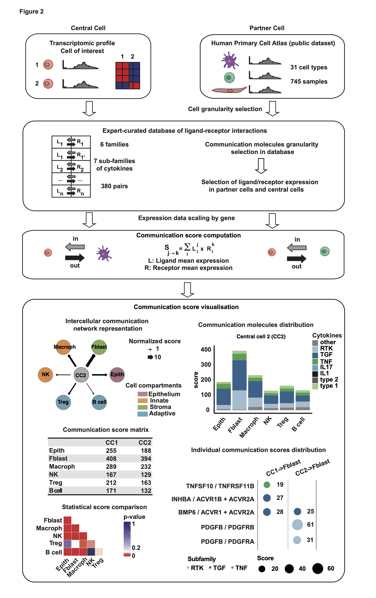

 
This vignette explains the use of the ICELLNET package and demonstrates typical workflows to dissect intercellular communication between multiple cell types, based on transcriptomic profiles.

---
# Table of content

- [Introduction to ICELLNET R package](#Introduction-to-ICELLNET-R-package)
  * [What is ICELLNET for?](##What-is-ICELLNET-for?)
  * [ICELLNET ligand/receptor interaction database](##ICELLNET-ligand/receptor-interaction-database) 
  * [Input data](##Input-data)
  * [How is the intercellular communication score computed?](##How-is-the-intercellular-communication-score-computed?)
  * [Typical workflow](##Typical-workflow)
  * [Visualisation modes](##Visualisation-modes)

  
- [How to install ICELLNET package?](#How-to-install-ICELLNET-package?)
- [How to format your own data to use ICELLNET package?](#How-to-format-your-own-data-to-use-ICELLNET-package?)
- [Use cases exemples](#Use-cases-exemples)

- [Software information](#Software-information)

<!-- toc -->
---


# Introduction to ICELLNET R package  <a name="Introduction-to-ICELLNET-R-package"></a>

## What is ICELLNET for? 

Cell-to-cell communication is at the basis of the higher-order organization observed in tissues and organisms, at steady state and in response to stress. The availability of large-scale transcriptomics datasets from several cell types has opened the possibility of **reconstructing cell-cell interactions based on co-expression of ligand-receptor pairs**.

We developed **ICELLNET**, a transcriptomic-based framework to **dissect cell communication in a global manner**. It integrates an original expert-curated **database of ligand-receptor interactions** taking into account multiple subunits expression. Based on transcriptomic profiles, ICELLNET package allows to compute **communication scores** between cells and provides **several visualization modes** that are helpful to dig into cell-cell interaction mechanism and extend biological knowledge. 

## ICELLNET ligand/receptor interaction database  

We curated a comprehensive database of ligand-receptor interactions from the literature and public databases. This database takes into account the **multiple subunits** of the ligands and the receptors. Interactions have been classified into 6 families of communication molecules, with strong implication in inflammatory and immune processes: **Growth factors, Cytokines, Chemokines, Checkpoints, Notch family, Antigen binding**. Cytokines have been further classified into 7 subfamilies according to reference classifications essentially based on structural protein motifs: **type 1 cytokines, type 2 cytokines, IL-1 family, IL-17 family, TNF family, TGFb family and RTK cytokines**. 

Other interactions and classifications of molecules will be implemented.
The most recent version of ligand-receptor interaction database can always be downloaded [here](https://github.com/soumelis-lab/ICELLNET/blob/master/ICELLNETdb.tsv).
In R, you can visualize ICELLNET database and its structure: 

```{r db, echo=T}
db=as.data.frame(read.csv(curl::curl(url="https://raw.githubusercontent.com/soumelis-lab/ICELLNET/master/data/ICELLNETdb.tsv"), sep="\t",header = T, check.names=FALSE, stringsAsFactors = FALSE, na.strings = ""))
head(db)
```

You can use either all the database or restrict it by selecting some specific class of molecules (Cytokines, Growth factor etc..). Below, we show you how to restrict the study to cytokines, chemokines, and checkpoints, and how you can take into consideration subfamily of molecules.

```{r, echo=T}
summary(as.factor(db$Family)) # list of the different family of molecules considered in the database
db$Subfamily=db$Cytokine
summary(as.factor(db$Subfamily[which(db$Family=="Cytokine")])) # list of the different subfamily of cytokines considered in the database

#Restrict the database to some family of molecules 
my.selection.LR=c("Cytokine", "Chemokine", "Checkpoint")
db2 <- db[grepl(paste(my.selection.LR, collapse="|"),db$Classifications),] 
db.name.couple=name.lr.couple(db2, type="Family")
head(db.name.couple)

#Restrict the database to cytokines and consider the subfamilies of cytokines
my.selection.LR=c("Cytokine")
db3 <- db[grepl(paste(my.selection.LR, collapse="|"),db$Classifications),] #if you want to use all the database, do instead : db2=db
db.name.couple=name.lr.couple(db3, type="Subfamily")
head(db.name.couple)
```
Instead of using the ICELLNET database, it is also possible to use its own database as long as it is correctly formatted with specific columns as below. The Family and Subfamily colums correspond to two independant classifications (per family of molecules, or other) of your choice, but each interaction should fit only in one category of the classification (for example, an interaction cannot be classified in "type 1" and also "type 2" cytokines in the ICELLNET database). In the Classifications category, you should add all the terms used to classify the interaction : the one of Family, Subfamily, but also other words that can be used to select some specific interactions (for example "interleukin" in ICELLNET database).

|  Ligand 1 | Ligand 2  | Receptor 1  | Receptor 2  | Receptor 3  | Family | Subfamily | Classifications |
|---|---|---|---|---|---|---|---|
|   |   |   |   |   |   |   |   |
|   |   |   |   |   |   |   |   |


## Input data 

### Type of data

ICELLNET pipeline first considers the transcriptomic profile of the central cell, that can correspond to several biological conditions. ICELLNET will then allow to compare the communication channels used by the central cells in these different conditions with partner cells.
As partner cells, we can use Human Primary Cell Atlas, a public datasets of 745 transcriptomic profiles among 31 cell types generated with the same technology (Affymetrix microarray, hgu133plus2 platform), already processed. It is possible to select up to 14 different cell types to connect with the central cell (the different options are listed below, in PC.target.all$Class).This number was chosen for clarity purpose. The user can also use other transcriptomic profiles instead of Human Primary Cell Atlas.

```{r,echo=T}
#download PC.data.all and PC.target.all objects from the github and open them on your Rstudio session - adapt path if needed
PC.data.all=as.data.frame(read.csv("~/Downloads/PC.data.all.csv", sep=",", header = T, check.names=FALSE, stringsAsFactors = FALSE, na.strings = ""))
PC.target.all=as.data.frame(read.csv("~/Downloads/PC.target.all.csv", sep=",",header = T, check.names=FALSE, stringsAsFactors = FALSE, na.strings = ""))

head(PC.data.all[1:5,1:5])
```
List of possible partner cell types :  Adipo, Adr_med, B cell, chondro, DC (or if desired: CD16 DC, DC1, DC2, moDC, pDC), Endoth, Epith, ESM, gameto, Hepato, HSC, Kerat, lps_cells, Macroph, Mono, Neutrop, NK, ostblast, Shwann, SMC, T cell (or if desired: CD4 T cell, CD8 T cell, Treg), TSC: 

```{r,echo=T}
table(PC.target.all$Class_broad)
table(PC.target.all$Class)
```

## How is the intercellular communication score computed?

The quantification of intercellular communication consist of scoring the intensity of each ligand/receptor interaction between two cell types with known expression profiles. No filtering threshold is applied on the L/R expression. If the communication molecule (ligand or receptor or both) is not expressed by a cell, the score will be zero. By default, all interactions of the database are considered to compute the score. It is also possible to reduce the number of interactions by manually selecting specific families of molecules in the database or considering DEG to compute the score, depending on the biological question. Whenever needed, we take into account multiple ligand units, or receptor chains, using logical rules.

The score of an individual ligand/receptor interaction is computed as the product of their expression levels respectively by the source (central) and by the target (partner) cell. These individual scores are then combined into a global metric assessing the overall exchange of information between the cell types of interest

Since cell-to-cell communication is directional, we consider ligand expression from the central cell and receptor expression from the partner cells to assess outward communication. On the other way, we select receptor expression from the central cell and ligand expression from partner cells to assess in-flow communication. This is controlled by the  *direction* argument ("in" or "out") in the `icellnet.score()` function. 

```{r,echo=T}
#not run - exemple
score.computation.1= icellnet.score(direction="out", PC.data=PC.data, CC.data= CC.data.selection.S1,  
                                    PC.target = PC.target, PC=my.selection, CC.type = "RNAseq", 
                                    PC.type = "Microarray",  db = db2)
score1=as.data.frame(score.computation.1[[1]]) #communication scores
lr1=score.computation.1[[2]] # detail of the ligand/receptor interactions scores matrix

```


## Typical workflow 
 
Here we describe the different stages of the ICELLNET package to compute intercellular communication scores: 

1. Selection of the genes coding for the ligands and the receptors in our database from the transcriptomic profiles of the central cell and the partner cells. 

2. Rescale gene expression to avoid communication score to be driven only by highly expressed genes.

3. Compute ICELLNET communication scores

4. Display different visualisation modes to dissect intercellular communication scores 



## Visualisation modes

### Intercellular communication network representation

This allows to visualize intercellular communication networks in a global manner through the function `network.create()`. In these directed graphs, nodes represent cell types, the width of the edges connecting two cell types is proportional to a global measure of the intensity of the communication between them and the arrows indicate the direction of communication. 

### Communication molecules distribution

The barplot representation (`LR.family.score()` function with plot=T) allows to dissect the global scores at a level of class of molecules, and allows to identify patterns of co-expressed molecules from the same family. This layer of analysis helps the interpretation on a qualitative level.

### Individual communication scores distribution

The balloon plot (`LR.balloon.plot()` function) is the deepest level of representation of the communication, displaying the most contributing ligand/receptor pairs to the communication score. This allows to identify specific individual interactions that can drive the intercellular communication and should be confirmed experimentally. 

### Pvalue computation to compare communication scores

Two types of pvalue can be computed (`icellnet.score.pvalue()` function), to compare either the communication scores obtained from the same central cell to different partner cells (between="cells"), or to compare the communication scores obtained from two different central cells corresponding to different biological conditions with the same partner cell (between="conditions").If between="cells", the communication score is computed considering the average expression of ligands for the central cell, and each replicates separately for the receptor expression of the partner cells. In this way, for one partner cell, we obtain a distribution of n communication scores, n beeing the number of partner cells replicates for this particular cell type. If between="conditions", then, the communication score is computed considering each replicates of the central cell separately, and the average gene expression for the partner cells. We obtain a distribution of n communication scores, n beeing the number of central cell replicates in one biological condition. Then, a Wilcoxon statistical test is performed to compare the communication scores distributions. The pvalues are ajusted with `stats::p.adjust()`, with "BH" method as a default. 

It returns the pvalue matrix of statistical tests, that can be visualize as a heatmap with the `pvalue.plot()` function. This allows to interpret the difference of communication score in a quantitative manner.
 
# How to install ICELLNET package? <a name="How-to-install-ICELLNET-package?"></a>

To install `icellnet` package, the easiest way is to use the `R` package `devtools` and its function `devtools::install_github()`. If you don't have all the dependancies needed to use ICELLNET package, run the commands below:  

    install.packages(c("devtools", "curl", "jetset", "readxl", "psych", "GGally", "gplots", "ggplot2", "RColorBrewer", "data.table", "grid", "gridExtra", "ggthemes", "scales","rlist")) ##Installs devtools and the icellnet CRAN dependancies

    if (!requireNamespace("BiocManager", quietly = TRUE)) # Installs Bioconductor dependancies 
    install.packages("BiocManager")
    BiocManager::install(c("BiocGenerics", "org.Hs.eg.db", "hgu133plus2.db", "annotate"))
    
Then you just have to load `devtools` package and run the command below:

    library(devtools)
    install_github("soumelis-lab/ICELLNET",ref="master", subdir="icellnet")
    
Then load the dependancies below and `icellnet` package.

library(BiocGenerics)
library("hgu133plus2.db")
library(jetset)
library(ggplot2)
library(dplyr)
library(icellnet)

To load the most recent version of the ligand/receptor database, you should run the command below (last updated:  28/01/2021): 

    db=as.data.frame(read.csv(curl::curl(url="https://raw.githubusercontent.com/soumelis-lab/ICELLNET/master/data/ICELLNETdb.tsv"), sep="\t",header = T, check.names=FALSE, stringsAsFactors = FALSE, na.strings = ""))


# How to format your own data to use ICELLNET package? <a name="How-to-format-your-own-data-to-use-ICELLNET-package?"></a>

## Data files format
**For the central cell:** It can be any transcriptomic profile data of one cell type. For **RNA-seq data**, the dataset should be a datframe annotated with gene symbol as rownames. For **microarray data**, the ICELLNET functions are adapted to handle Affymetrix Human Genome U133 Plus 2.0 Array annotation. Nevertherless, if the dataset have been generated with an other Affymetrix technology, you have 2 possibilities to adapt the tool : a) Annotate your data with gene symbol before using ICELLNET and then consider your data as "RNA-Seq" for CC.type argument. b) adapt the R code of the `db.hgu133plus2()` function to have the adapted annotation conversion when using ICELLNET. Gene annotations should be set as rownames. 


**For the partner cell (if you don't want to use Human Primary Cell Atlas as partner cells):** This can be interesting for example if you possess transcriptomic data of several cell types of the same sample, to see how they interact together. As for the central cell, the transcriptomic profiles should be correctly formated (see previous paragraph above for more information). If your transcriptomic profiles are annotated with gene symbol, PC.type should be set to "RNA-seq" (even if your data come from microarray technology). 

## Target files format
You should define two dataframes as target files, one corresponding to the central cell, and the other one corresponding to the partner cells. These dataframe usually describes the different samples. 

**PC.target** should contains at least an 'ID' column including the name of the samples (usually rownames(PC.target) or colnames(PC.data) ), and a 'Class' column corresponding to a classification of your different samples included in PC.target, such as a cell type classification. The different categories included in the 'Class' column will define the different partner cells in the graphs.


# Use cases exemples


- [Case study 1] (https://github.com/soumelis-lab/ICELLNET/blob/master/Exemple1_CAF.md ) : dissect intercellular commmunication of Cancer Associated Fibroblasts subsets. Show how to apply ICELLNET pipeline on transcriptomic profiles from 2 CAF-subsets, and how to restrict use of icellnet database to cytokines only (or other family of molecules).

- Case study 2: Application to single cell data (coming soon).


# Software information <a name="Software-information"></a>

```
session.info()
```
R version 4.0.3 (2020-10-10)
Platform: x86_64-apple-darwin17.0 (64-bit)
Running under: macOS Mojave 10.14.6

Matrix products: default
BLAS:   /System/Library/Frameworks/Accelerate.framework/Versions/A/Frameworks/vecLib.framework/Versions/A/libBLAS.dylib
LAPACK: /Library/Frameworks/R.framework/Versions/4.0/Resources/lib/libRlapack.dylib

locale:
[1] fr_FR.UTF-8/fr_FR.UTF-8/fr_FR.UTF-8/C/fr_FR.UTF-8/fr_FR.UTF-8

attached base packages:
[1] stats4    parallel  stats     graphics  grDevices utils     datasets  methods   base     

other attached packages:
 [1] readxl_1.3.1         dplyr_1.0.3          icellnet_0.99.1      ggplot2_3.3.3        jetset_3.4.0         hgu133plus2.db_3.2.3
 [7] org.Hs.eg.db_3.12.0  AnnotationDbi_1.52.0 IRanges_2.24.1       S4Vectors_0.28.1     Biobase_2.50.0       BiocGenerics_0.36.0 

loaded via a namespace (and not attached):
 [1] Rcpp_1.0.6       cellranger_1.1.0 pillar_1.4.7     compiler_4.0.3   plyr_1.8.6       tools_4.0.3      bit_4.0.4        nlme_3.1-151    
 [9] lattice_0.20-41  memoise_2.0.0    RSQLite_2.2.3    lifecycle_0.2.0  tibble_3.0.5     gtable_0.3.0     pkgconfig_2.0.3  rlang_0.4.10    
[17] psych_2.0.12     cli_2.2.0        DBI_1.1.1        rstudioapi_0.13  fastmap_1.1.0    gridExtra_2.3    withr_2.4.1      stringr_1.4.0   
[25] generics_0.1.0   vctrs_0.3.6      bit64_4.0.5      grid_4.0.3       tidyselect_1.1.0 glue_1.4.2       R6_2.5.0         fansi_0.4.2     
[33] blob_1.2.1       reshape2_1.4.4   purrr_0.3.4      magrittr_2.0.1   scales_1.1.1     ellipsis_0.3.1   assertthat_0.2.1 mnormt_2.0.2    
[41] colorspace_2.0-0 stringi_1.5.3    munsell_0.5.0    tmvnsim_1.0-2    cachem_1.0.1     crayon_1.3.4